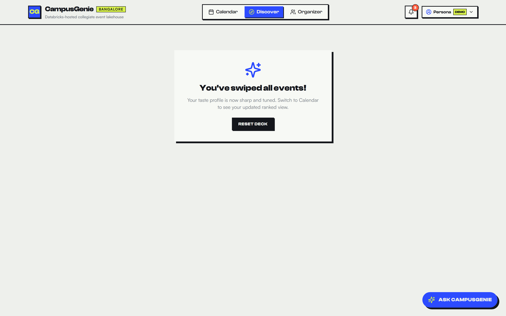
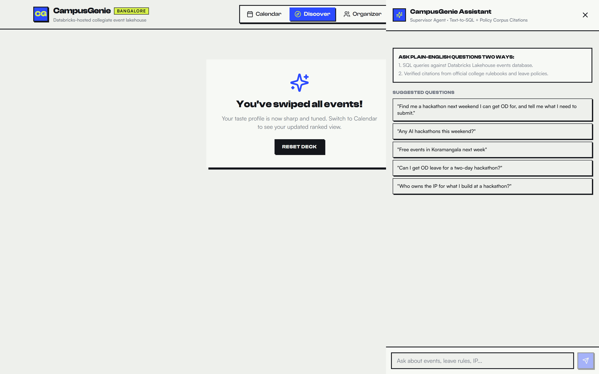
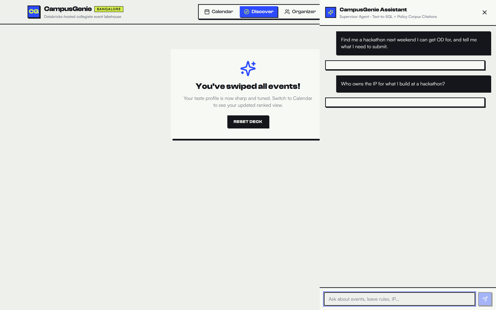
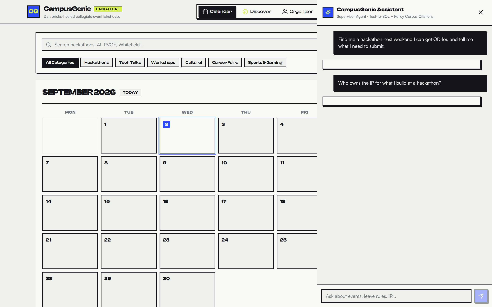
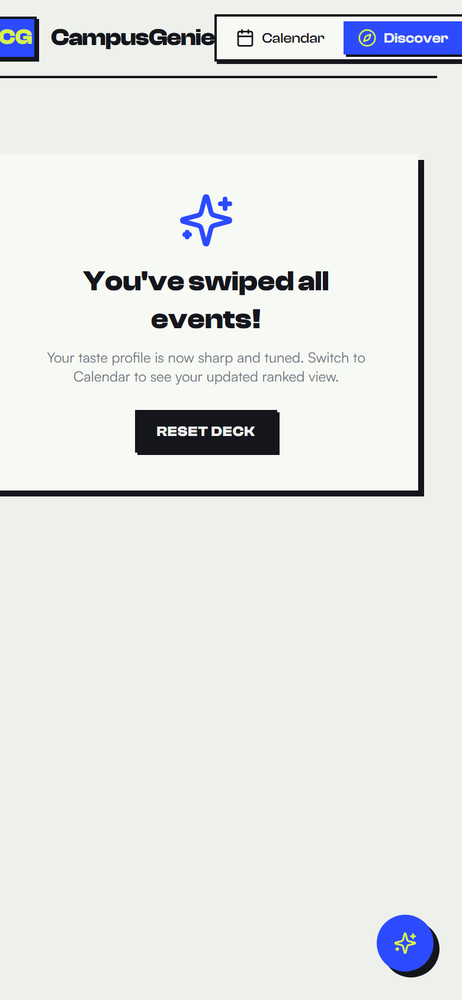
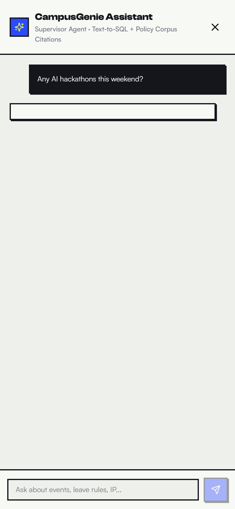
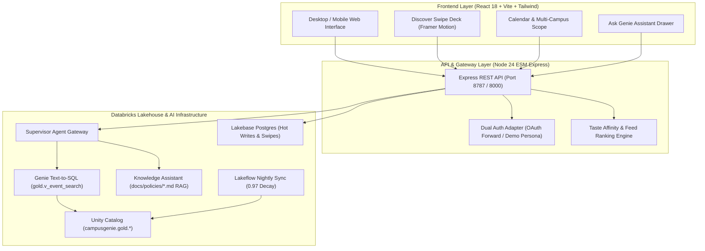

# CampusGenie 🧞‍♂️
### Databricks-Hosted Collegiate Event Discovery & Policy Intelligence Platform for Bangalore

[](https://www.databricks.com/)
[](https://www.databricks.com/product/unity-catalog)
[](https://react.dev/)
[](https://nodejs.org/)
[](https://opensource.org/licenses/MIT)

**CampusGenie** is a high-performance collegiate intelligence and discovery platform built for Bangalore university students (centered on **CHRIST (Deemed to be University)** and spanning across Bangalore's collegiate ecosystem including RVCE, PES, BMS, IIIT-B, and IISc). 

It solves the dual fragmentation problem students face every week: **finding relevant hackathons, technical workshops, cultural fests, and conferences across the city**, while **navigating institutional bureaucracy (OD leave approvals, permission letters, travel grants, and hackathon IP ownership policies)**.

---

## 📸 Visual UI Overview & Feature Highlights

### 1. 🎴 Discover Mode — Tinder-Style Swipe Deck & Recommendation Engine
Discover reimagines collegiate event exploration with a gesture-driven swipe deck. As students swipe through events, CampusGenie builds a continuous **Taste Profile Vector** (tracking category affinities, campus proximity, prize pools, and attendance intent) with zero latency.



#### Key Capabilities:
- **Kinetic Gesture Deck**: Smooth Framer Motion drag, flip, like (♥), pass (✕), and super-like (↑) mechanics with keyboard bindings (`←` / `→` / `↑` / `Space`).
- **Dynamic Category Art & Risograph Badges**: Visual indicators for registration deadlines, seat scarcity, team constraints, and entry fees.
- **Match Interstitials**: Every 10 swipes, CampusGenie computes high-confidence event matches and presents an interstitial recap of aligned opportunities.
- **Taste Profile Matcher**: Instant toggle between algorithmic taste-ranked recommendations and raw chronological discovery.


---

### 2. 🧞 Ask Genie — Databricks-Powered Supervisor AI Assistant
The **Ask Genie** drawer is a hybrid conversational intelligence interface powered by a Databricks Supervisor Agent routing between **Text-to-SQL over Unity Catalog (`gold.v_event_search`)** and **Knowledge Assistant clause retrieval over official university bylaws and hackathon rulebooks**.



#### 🔹 Hybrid Text-to-SQL + Policy Citations
Ask complex natural language questions like *"Find me a hackathon next weekend I can get OD for, and tell me what I need to submit."* 

CampusGenie executes the underlying SQL query against the Lakehouse, renders the interactive event cards, displays the exact executed SQL query for verification, and attaches clause-level rulebook citations:


#### 🔹 Institutional Policy & Rulebook QA
Students can clarify complex university rules with pinpoint precision:
- **OD (On-Duty) Leave Policy**: Contiguous clause citations on minimum attendance thresholds (85%), pre-approval deadlines (3 working days prior), and faculty sign-offs.
- **Hackathon IP Ownership**: Verification of student IP retention vs. university/sponsor claims.
- **Travel Reimbursements & Permission Letters**: Required document checklists and sanction workflows.



---

### 3. 🗓️ Comprehensive Collegiate Calendar & Multi-Campus Scope
CampusGenie provides a bird's-eye view of everything happening in Bangalore's academic sphere with a live calendar grid, mobile agenda feed, and deep categorical filters.



#### Key Highlights:
- **Scope Switching**: Seamlessly toggle between **Campus** (CHRIST Central, Kengeri, Yeshwanthpur, Bannerghatta) and **City** (All Bangalore engineering & degree colleges).
- **Deep Filter Rail**: Filter by Hackathons, Tech Talks, Workshops, Cultural Fests, Career Fairs, and Gaming.
- **Fidelity-Tiered Registration**: 3-stage attendance tracking (`intent` ➔ `self_reported` ➔ `verified`) with India DPDP Act compliance consent sheets.

---

### 4. 📱 Mobile-First Responsive Design
CampusGenie is designed from the ground up for 375px mobile screens, delivering native app responsiveness on mobile browsers.

| Mobile Discover Deck | Mobile Ask Genie Assistant |
|:---:|:---:|
|  |  |

---

## 🏛️ System Architecture



---

## 📊 Databricks Lakehouse Assets & Schemas

| Asset Path | Type | Description |
|---|---|---|
| `data/sql/01_delta.sql` | DDL | Unity Catalog gold tables (`events`, `users`, `swipes`, `registrations`) |
| `data/sql/02_view.sql` | View | `gold.v_event_search` optimized with derived fields (`days_until`, `seats_left`, `tags_csv`) |
| `data/sql/03_lakebase.sql` | SQL | Postgres Lakebase schema for <30ms hot writes, user swipe buffers, and live chat logs |
| `data/sql/04_load_seed.py` | PySpark | Lakehouse seed pipeline and baseline tag affinity computation |
| `data/genie/instructions.md` | Genie Spec | System instructions, domain rules, and semantic column mappings |
| `data/genie/example_queries.sql` | SQL | Golden evaluation queries and SQL templates |
| `data/genie/benchmarks.json` | JSON | 15 golden benchmark evaluation questions & expected predicates |
| `docs/policies/` | Corpus | 4 University Policies (OD, Permission, Travel, Club) + 4 Hackathon Rulebooks with numbered clauses |

---

## ⚡ Quickstart & Local Development

CampusGenie runs completely standalone in **Zero-Network Mock Mode** with 252 Bangalore events, 8 student personas, and instant in-memory SQL/Policy evaluation.

### 1. Clone & Run API Server
```bash
git clone https://github.com/Bhawikgolchha/Null-Theory-1.git
cd Null-Theory-1

# Start Server (DATA_MODE=mock by default on Port 8787)
cd server
npm install
npm run dev
```

### 2. Run Client (Development Mode)
```bash
# In a second terminal:
cd client
npm install
npm run dev
```
Open **`http://localhost:5173`** to access CampusGenie.

### 3. API Smoke Tests
```bash
# Health check
curl http://localhost:8787/api/health

# Query campus events
curl "http://localhost:8787/api/events?scope=campus"

# Test Ask Genie hybrid query
curl -X POST http://localhost:8787/api/chat \
  -H "Content-Type: application/json" \
  -d '{"message":"Can I get OD leave for a two-day hackathon?"}'
```

---

## ☁️ Deploying to Databricks Apps

1. **Configure Environment Variables**:
   Copy `server/.env.example` to `server/.env` and set `DATA_MODE=databricks`:
   ```ini
   DATA_MODE=databricks
   DATABRICKS_HOST=https://<your-workspace>.cloud.databricks.com
   DATABRICKS_HTTP_PATH=/sql/1.0/warehouses/<warehouse-id>
   DATABRICKS_CATALOG=campusgenie
   GENIE_EVENTS_SPACE_ID=<genie-space-id>
   KA_POLICIES_ENDPOINT=<knowledge-assistant-endpoint>
   SUPERVISOR_AGENT_ENDPOINT=<supervisor-agent-endpoint>
   LAKEBASE_URL=postgresql://<user>:<pwd>@<host>:5432/campusgenie
   ```

2. **Deploy via Databricks CLI / App Manifest**:
   ```bash
   # Deploy using app.yaml / render.yaml
   databricks apps deploy campusgenie --source-code-path .
   ```

---

## 👥 Contributors & Hackathon Team
- **Bhawik Golchha** & The Null Theory Team
- Built for the Bangalore Collegiate Community & Databricks Hackathon

---
*License: MIT*
